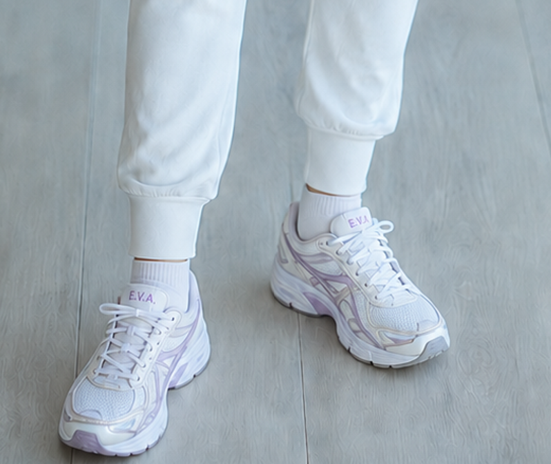

# E.V.A. — Local-First Edge AI Assistant

**E.V.A.** is an evolving local-first AI assistant project for Windows, designed around natural voice interaction, local AI processing, speaker awareness, contextual reasoning and desktop assistance.

The name **E.V.A.** evolves together with the project:

| Generation | Meaning | Focus | Status |
| --- | --- | --- | --- |
| **E.V.A. 1.x** | **Entertainment Vocal Assistant** | Voice assistant originally integrated with SingUp | Previous generation |
| **E.V.A. 2.0** | **Enhanced Vocal Assistant** | Standalone local-first AI assistant | **Active development** |
| **E.V.A. 3.0** | **Emotional Vocal Assistant** | Prosody-aware and context-adaptive interaction | Research / planned evolution |

> **Entertainment → Enhanced → Emotional**

---

## Current generation — E.V.A. 2.0

**E.V.A. 2.0 — Enhanced Vocal Assistant** represents the transition from a voice feature embedded in another application to an independent local AI assistant.

The goal is not to build a simple voice chatbot, but a modular assistant capable of combining speech, local AI reasoning, user context and real desktop actions.

### Current areas of development

- local speech recognition;
- local LLM-based conversational reasoning;
- intent detection and routing;
- speaker awareness and voice identity experiments;
- contextual and persistent memory;
- desktop command execution;
- natural voice synthesis;
- conversational state management;
- graphical avatar interaction;
- conservative ASR repair for imperfect speech transcription.

---

## Meet E.V.A.

E.V.A. 2.0 is being developed not only as a voice interface, but as a visual and conversational presence for the local AI assistant.

The current avatar concept explores a consistent visual identity for desktop interaction, voice feedback and future multimodal experiences.

> **E.V.A. 2.0 — Live demo coming soon.**

<p align="center">
  
</p>

### E.V.A. 2.0 — Visual identity

<p align="center">
  
  
</p>

### Design detail

<p align="center">
  
</p>

The E.V.A. branding is designed to extend beyond the interface into a recognizable visual identity. The current footwear concept includes a custom **E.V.A.** signature detail as part of the character design.

*Current E.V.A. 2.0 avatar concept. Visual design may evolve during development.*

---

## High-level architecture

```text
Microphone
    ↓
Speech Recognition
    ↓
ASR Repair / Normalization
    ↓
Intent & Context Layer
    ↓
Local LLM
    ↓
Orchestration
   ↙      ↓       ↘
Memory  Desktop   Conversation
         Actions
             ↓
      Voice Synthesis
             ↓
           Avatar
